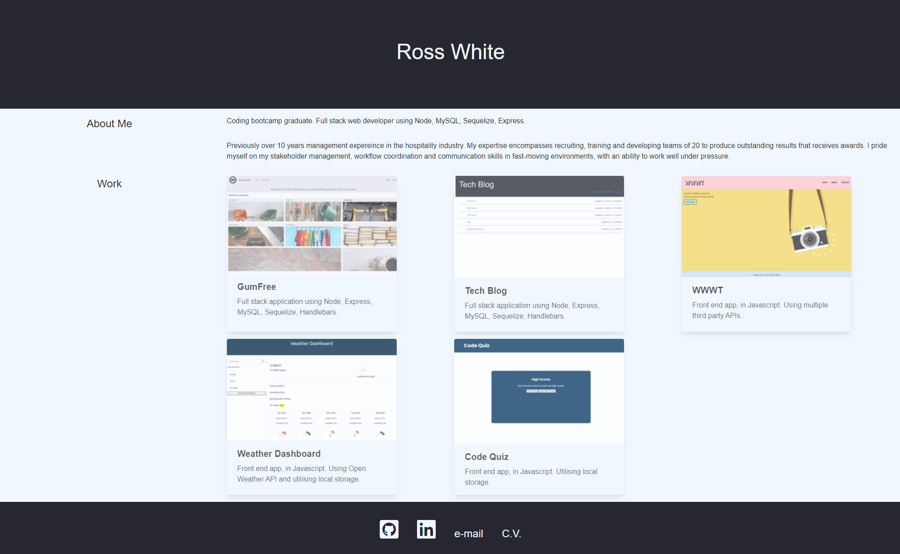

# Professional Portfolio

Creating a professional portfolio of my work to showcase my skills for prospective employers. Containing: 

* Links to selected depolyed applications.
* Links to my personal Github, LinkedIn profiles.
* A downloadable link to my C.V. 

# Technology Used
* CSS framework- Bulma
* HTML

# Images of application

* Screenshot

# Link to depolyed application

https://ross-white.github.io/Portfolio/
